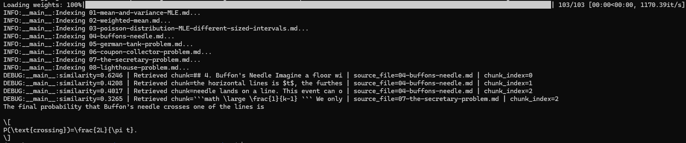

# Mini RAG System From Scratch

This project is a Retrieval-Augmented Generation system built from scratch in Python.

The motivation for the project came from a real problem I was facing. I had started creating a portfolio of mathematical statistics and probability derivations using Excalidraw's Math Preview, but as the number of derivations grew, it became harder to quickly find the exact derivation, explanation, or pattern I was looking for and the site started to become slow on startup.

Rather than manually searching through my derivations, I wanted to build a system that could retrieve the most relevant parts of my notes and use an LLM to answer questions about them.

Recognizing this was a retrieval problem, I decided to build a mini RAG pipeline that indexes my own derivations, embeds them, stores them in a vector database, retrieves the most relevant chunks using cosine similarity, and passes that context into an LLM to generate answers.

## Knowledge Base

This project uses my separate statistics derivation repository as its knowledge base: [Statistics for AI](https://github.com/Daniel-Lawless/Statistics-for-ai)

That repository contains my original human-readable derivation notes, written in Markdown. The notes cover probability and statistics problems relevant to AI and machine learning, such as the Lighthouse Problem, Buffon's Needle, the German Tank Problem, the Coupon Collector Problem, the Secretary Problem, and inverse-variance weighting.

For this RAG system, I keep a processed copy of those notes inside the `data/` directory. The files in that directory are based on the original notes, but are adapted slightly for retrieval. For instance, I added short descriptions around diagrams and images so that the RAG system can understand the meaning of them without needing OCR or image-processing capabilities.

## What I Built

I built a small Retrieval-Augmented Generation pipeline from scratch in Python for querying my own mathematical statistics derivation notes. The project was intentionally built from scratch instead of using a full RAG framework, so that I could understand how chunking, embeddings, vector search, retrieval, and prompt construction work.

The system takes Markdown files from the `data/` directory, splits them into overlapping chunks, embeds each chunk, stores the chunks in a vector database, retrieves the top-k most relevant chunks for a user query, and passes those chunks into an LLM to generate an answer.

The main components are:

- **Recursive chunking**  
  The system aims to split the Markdown notes using natural document structure where possible. It tries to split by paragraphs first, then sentences, then newlines, before falling back to fixed-size word chunks. This helps keep related explanations, equations, and definitions together.

- **Chunk overlap**  
  Each chunk can include words from the previous chunk. This helps preserve context when an explanation continues across a chunk boundary.

- **SentenceTransformer embeddings**  
  Each chunk is converted into a vector embedding using a SentenceTransformer model. The embeddings are normalized so cosine similarity can be calculated using a dot product, making search more efficient.

- **In-memory vector database**  
  The vector database stores each chunk as a record containing the chunk text, its embedding, and metadata such as the source file and chunk index.

- **Metadata-aware retrieval**  
  Retrieved chunks include their source file and chunk index. This makes the system easier to debug because I can see where each retrieved piece of context came from.

- **Vectorized similarity search**  
  Instead of looping through every embedding one by one, the system stacks all chunk embeddings into a NumPy matrix and calculates all query-to-chunk similarities at once using matrix multiplication, making retrieval faster and easier to scale than a manual Python loop.

- **Efficient top-k retrieval**  
  The system uses `np.argpartition()` to find the top-k most similar chunks without fully sorting every similarity score.

- **LLM response generation**  
  The retrieved chunks are combined into a context window and passed to an OpenAI model. The model is instructed to answer using only the retrieved context, and to say when the answer is not available in the provided notes.

Overall, the project implements the core stages of a RAG system:

```text
Data -> Chunking -> Embeddings -> Vector database -> Similarity search -> Top-k retrieval -> Prompt construction -> LLM response
```

## Example Query:

Example question 1:

```text
What is the final probability for Buffon's Needle?
```

The system will embed this query and will retrieve the k most relevant chunks from the notes, including their source file and chunk index, then passes that retrieved context into the LLM to generate an answer. We can see from the output that the chunks with the highest similarity to my query are from `04_Buffons_Needle.md`, which is what we expect, since this file contains information about the Buffon's Needle problem. This example shows the RAG pipeline retrieving information from the Buffon's Needle derivation and using it to answer the question from the provided context:



Example Question 2:

```text
What is the German Tank Problem?
```

Similarly the system will embed this query and will retrieve the k most relevant chunks from the notes. We can see from the output that the chunks with the highest similarity come from the source file `05_german_tank_problem.md`, which is what we expect, since this file contains information about the German Tank Problem. 

Example output:


## What I Learned

Building this project helped me understand the core parts of a RAG system from first principles.

Some of the main things I learned were:

- **RAG is mostly a retrieval problem**  
  The final answer is only useful if the retriever finds the right context. Improving chunking and retrieval quality often matters more than changing the LLM.

- **Chunking has a large effect on answer quality**  
  Fixed-size chunks are simple, but they can split explanations or equations in awkward places. Recursive chunking helped preserve more of the original document structure, which helped preserve context.

- **Overlap helps preserve context**  
  Adding overlap between chunks reduces the chance that important information is lost when an explanation crosses a chunk boundary.

- **Normalized embeddings simplify cosine similarity**  
  By normalizing each embedding, cosine similarity can be calculated using a dot product.

- **Metadata makes retrieval easier to debug**  
  Storing the source file and chunk index for each chunk made it much easier to check whether the system was retrieving the correct notes.

- **Vectorization improves retrieval efficiency**  
  Stacking embeddings into a NumPy matrix allows the system to compare a query against every chunk using one matrix multiplication instead of looping through each embedding.

- **RAG data needs to be machine-readable**  
  My original derivation notes were written for humans, but the RAG version needed extra text descriptions around diagrams so the system could understand them without OCR or image processing.

## How to Run

### 1. Clone the repository

```bash
git clone https://github.com/Daniel-Lawless/Mini-rag-system-from-scratch.git
cd Mini-rag-system-from-scratch
```

### 2. Create and activate a virtual environment

```bash
Linux:
python3 -m venv venv
source venv/bin/activate

Windows PowerShell:
python -m venv venv
venv\Scripts\Activate.ps1
```

### 3. Install dependencies
```bash
pip install -r requirements.txt
```

### 4. Set your OpenAI API key
```bash
On Linux/macOS:
export OPENAI_API_KEY="your_api_key_here"

On Windows PowerShell:
$env:OPENAI_API_KEY="your_api_key_here"
```

### 5. Run the RAG pipeline

```bash
python src/rag_pipeline.py
```

## Limitations and Future Improvements

This project is intentionally simple because the goal was to understand the fundamentals of RAG rather than use a production-ready framework.

Current limitations:

- The vector database is stored in memory and rebuilt each time the program runs.
- Embeddings are not currently saved and reloaded from disk.
- The system only searches over a small local Markdown knowledge base.
- The system retrieves chunks based only on embedding similarity.
- Images are not processed directly, so diagrams need textual descriptions in the Markdown files.

Possible future improvements:

- Save embeddings to disk so the index does not need to be rebuilt every run.
- Add a command-line interface for asking custom questions.
- Add tests for chunking, retrieval, and pipeline behaviour.
- Add source citations to the final generated answer.
- Compare different chunk sizes, overlap values, and embedding models.
- Add hybrid search using both keyword search and vector similarity.

## Completed roadmap
- [x] Build an in-memory vector database
- [x] Add cosine similarity search
- [x] Add chunking with overlap
- [x] Add SentenceTransformer embeddings
- [x] Connect retrieved chunks to OpenAI generation
- [x] Add metadata storage for chunks
- [x] Improve chunking with paragraph/sentence-aware splitting
- [x] Vectorize search using NumPy matrix multiplication
